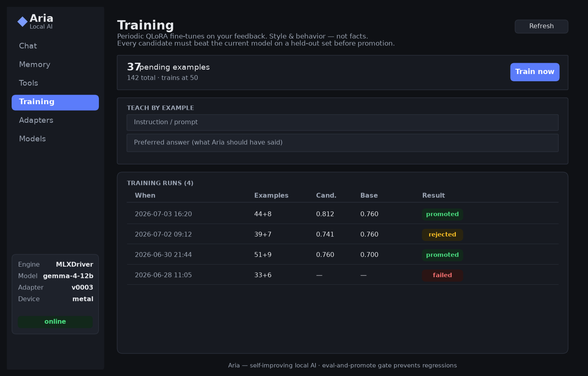

# Aria — a self-improving local AI

Aria is a small cross-platform desktop app that runs an open-source model
(**Google Gemma 4**) **entirely on your machine, offline**, learns from *your*
data, and shows you everything it knows — memory, tools, training runs, and
model adapters — in one inspector UI.

Nothing leaves your laptop. No API keys, no cloud, no telemetry.

It also **talks back in a natural voice** — fully offline — and can hold a
spoken conversation for as long as you like. Speech starts on the first
sentence (no waiting for the whole answer), flows without gaps, and stops the
instant you interrupt.



---

## What "self-improving" actually means

There are two honest mechanisms, and Aria uses both for what each is good at:

| Mechanism | What it changes | Speed | Used for |
|-----------|-----------------|-------|----------|
| **Memory / RAG** | Adds *facts* the model can retrieve | Instant | "Remember my sister's birthday is May 3." Things you tell it. |
| **QLoRA fine-tune** | Adjusts *behavior & style* | Batched, periodic | "Always answer concisely, in my voice." Learned from feedback. |

**Facts go in memory, not weights.** Training a fact into the weights is slow,
lossy, and easy to forget. Retrieval is instant and exact. So Aria stores what
you tell it in a vector database (RAG) and *retrieves* it at answer time.

**Behavior is learned by periodic QLoRA** on the feedback you give (thumbs up /
corrections). This is **not** done per-message — that would cause catastrophic
forgetting. Instead examples accumulate, and when enough pile up Aria runs a
fine-tune in the background.

**The eval-and-promote gate is the safety net.** A freshly trained adapter is
*never* trusted automatically. It must beat the current model on a held-out set
of your own examples before it's promoted. If it doesn't, it's rejected and the
old one stays active. You can roll back to any previous adapter at any time.
This is what keeps "self-training" from quietly making the model worse.

---

## Architecture at a glance

```
┌─────────────────────────────────────────────┐
│  Tauri shell (Rust)   — window, spawns sidecar│
│  ┌─────────────────────────────────────────┐ │
│  │  Web UI (HTML/CSS/JS, no framework)      │ │
│  │  Chat · Memory · Tools · Training ·      │ │
│  │  Adapters · Models                       │ │
│  └───────────────┬─────────────────────────┘ │
│                  │ JSON over localhost:8765    │
│  ┌───────────────▼─────────────────────────┐ │
│  │  Python sidecar (app.py)                 │ │
│  │  ┌─────────┐ ┌────────┐ ┌─────────────┐  │ │
│  │  │ Memory  │ │ Tools  │ │  Trainer +  │  │ │
│  │  │ (RAG)   │ │        │ │  eval gate  │  │ │
│  │  └────┬────┘ └───┬────┘ └──────┬──────┘  │ │
│  │       └──────────┴─────────────┘         │ │
│  │              Engine driver (ABC)         │ │
│  │        MLX ▸ llama.cpp ▸ fake            │ │
│  │              Voice driver (ABC)          │ │
│  │        Kokoro ▸ macOS say ▸ fake        │ │
│  └──────────────────┬──────────────────────┘ │
│         SQLite (metadata) + LanceDB (vectors) │
└─────────────────────────────────────────────┘
```

The **engine layer is pluggable** (`EngineDriver` ABC): MLX on Apple Silicon,
llama.cpp elsewhere, and a `fake` driver for tests (no weights needed). The
**voice layer is pluggable the same way** (`VoiceDriver` ABC): neural Kokoro,
the macOS `say` voices, or a silent `fake` for tests. Swapping either backend
never touches the app logic above it.

Full detail: [`docs/ARCHITECTURE.md`](docs/ARCHITECTURE.md) ·
data schemas: [`docs/schemas.md`](docs/schemas.md).

---

## Requirements

- **Apple Silicon Mac (M1 or later), 16 GB RAM minimum, 24 GB recommended.**
  (Other platforms run via the llama.cpp backend — see below.)
- **Python 3.10+**
- **Rust + Node** only if you want to build the desktop `.app`. You can run the
  whole thing without them (sidecar + browser) for development.

---

## Install the app (for everyone)

Want to *use* Aria, not develop it? Build a double-clickable macOS app:

```bash
cd local-ai-app
scripts/build-macos.sh     # → Aria.app + Aria_0.1.0_aarch64.dmg
```

This freezes the Python sidecar (no Python needed by end users), compiles the
desktop shell, and produces a `.dmg` under
`src-tauri/target/aarch64-apple-darwin/release/bundle/`. Share that `.dmg`;
recipients drag Aria to Applications and, the first time, right-click → **Open**
(one-time Gatekeeper step for unsigned apps). On first launch Aria downloads its
model (~7 GB) — one-time, then fully offline.

To ship it so it opens with a plain double-click (no warning), sign + notarize
with your Apple Developer ID — see **[docs/DISTRIBUTION.md](docs/DISTRIBUTION.md)**
for the full flow, prerequisites, and troubleshooting.

> Build prerequisites (build machine only): Xcode Command Line Tools, Rust,
> Node.js, Python 3.11+. End users need none of these.

---

## Quick start (Mac, for development)

```bash
# 1. clone / unzip, then:
cd local-ai-app
./setup.sh                 # creates venv, installs the MLX backend

# 2. download a model (one-time, ~7 GB for the 12B)
source python-sidecar/.venv/bin/activate
huggingface-cli download mlx-community/gemma-4-12b-it-4bit

# 3. run the sidecar
python python-sidecar/app.py --engine mlx --model gemma-4-12b --port 8765
```

Then either:
- **Dev mode:** open `src/index.html` in a browser (it talks to the sidecar on
  `:8765`), or
- **Desktop app:** `npm install && npm run tauri dev` (needs Rust + Node).

### Which model?

| Model | Size (4-bit) | Use it for |
|-------|--------------|------------|
| `gemma-4-e2b` | ~1.8 GB | Tiny / fast / phones |
| `gemma-4-e4b` | ~3.0 GB | **Training target** — QLoRA fits in 24 GB |
| `gemma-4-12b` | ~7.0 GB | **Recommended for chat** on a 24 GB Mac |

Aria trains on **E4B** (small enough to fine-tune locally) and can chat on the
**12B**. The trained adapters are portable.

---

## Running the tests

No model or GPU needed — the suite uses the `fake` engine driver.

```bash
./run_tests.sh
# 54 tests across memory, feedback, training gate, tools, voice, and integration
```

---

## Other platforms (Windows / Linux)

The MLX backend is Mac-only. Elsewhere, install the llama.cpp extra:

```bash
pip install -e "python-sidecar[llamacpp,memory]"
python python-sidecar/app.py --engine llamacpp --port 8765
```

The llama.cpp driver is currently a **stub** — the interface is defined and it
fails with clear messages. Wiring it to `llama-cpp-python` is a contained task
(see `engine/llamacpp_driver.py`). Phones/tablets are intended as
inference-only clients that sync desktop-produced adapters.

---

## Project layout

```
local-ai-app/
├─ README.md              ← you are here
├─ CLAUDE.md              ← handoff notes for Claude Code (finish it on your Mac)
├─ setup.sh, run_tests.sh
├─ docs/                  ← architecture, schemas, diagrams
├─ src/                   ← web UI (index.html, styles.css, app.js)
├─ src-tauri/             ← Rust desktop shell
└─ python-sidecar/        ← all the AI logic (see below)
   ├─ app.py              ← HTTP API + service wiring
   ├─ engine/             ← pluggable backends (mlx / llamacpp / fake)
   ├─ memory.py           ← RAG: chunk, embed, retrieve
   ├─ feedback.py         ← capture training examples
   ├─ trainer.py          ← QLoRA loop + adapter registry
   ├─ eval_gate.py        ← promote only if better
   ├─ tools.py            ← function-calling + call log
   ├─ store.py            ← SQLite schema
   └─ tests/              ← 54 tests, no weights required
```

---

## Status

| Layer | State |
|-------|-------|
| App logic (memory, feedback, trainer, eval gate, tools, voice pipeline, API, UI) | **Built & tested** — 54/54 passing on the `fake` engine |
| MLX backend (`engine/mlx_driver.py`) | **Fully implemented** against the mlx-lm API; never executed on Metal (no Apple GPU in the build sandbox) — verify-and-run on your Mac |
| Voice: chunker + speech session + API + UI | **Built & tested** on the `fake` voice (30 tests) |
| Voice: Kokoro / macOS `say` drivers | **Written** against their APIs; verify-and-run on the Mac (no audio device in the sandbox) |
| llama.cpp backend (`engine/llamacpp_driver.py`) | **Stub** — interface defined, methods raise clear errors; a contained task to wire to `llama-cpp-python` |
| Desktop `.app` bundle | Tauri shell written; compile on your Mac (`npm run tauri build`) |

Everything platform-independent runs and is tested here. The Mac-specific parts
— downloading weights, executing MLX/Metal inference + QLoRA, and compiling the
`.app` — run on your machine. The MLX driver is written and API-correct, so this
is *verify-and-run*, not build-from-scratch. See **[`CLAUDE.md`](CLAUDE.md)** for
the exact step-by-step with Claude Code.

License: the app is yours. Gemma 4 is under Google's Apache 2.0 license.
